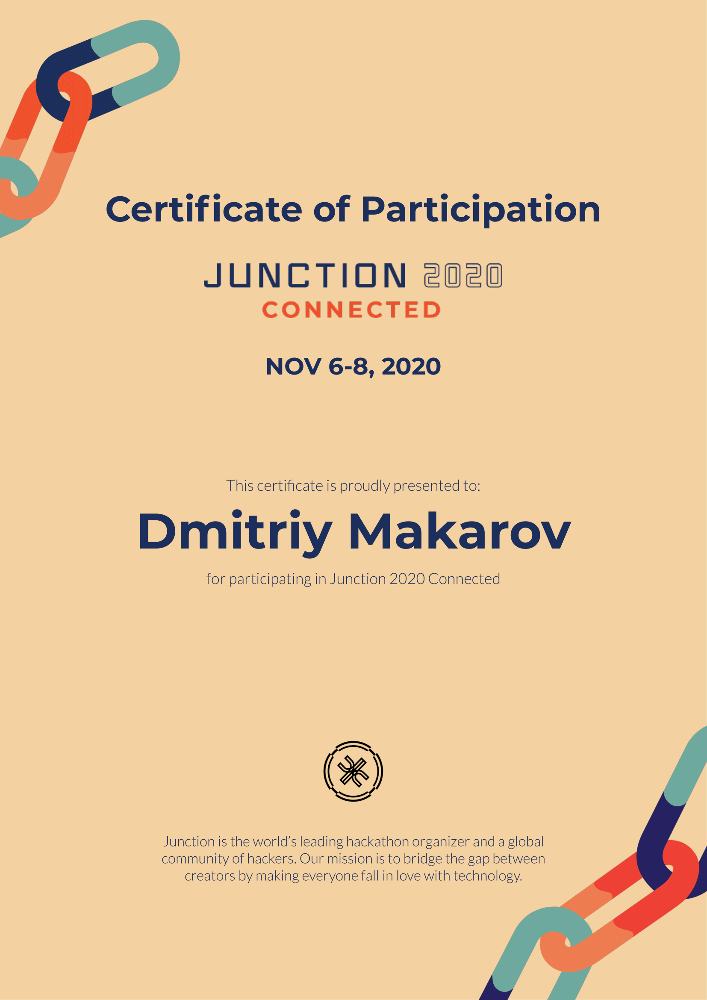
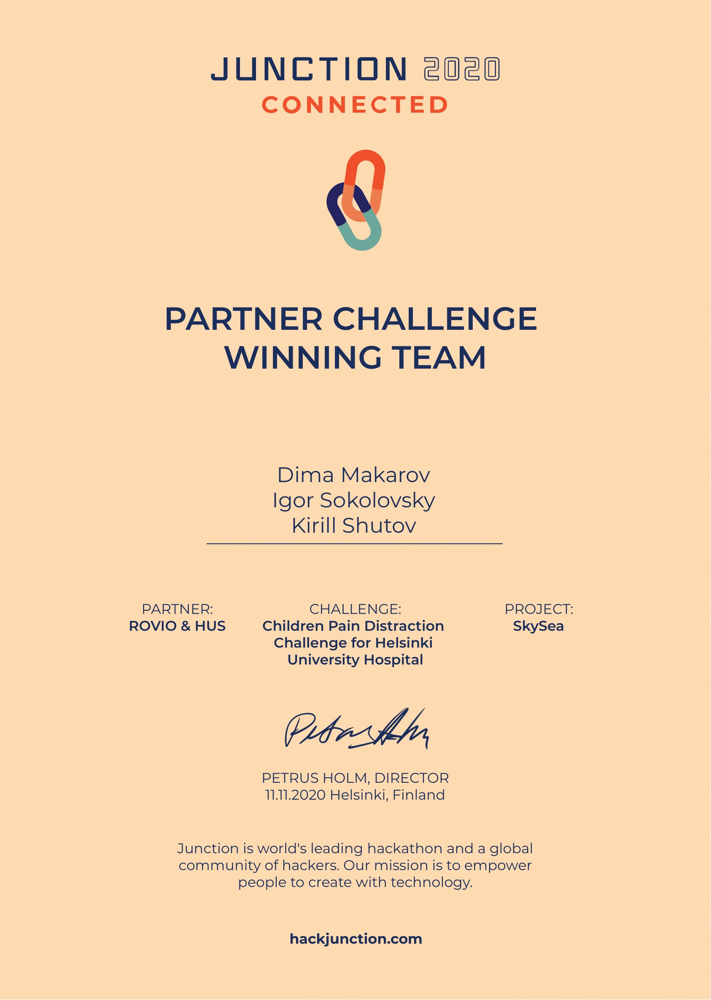
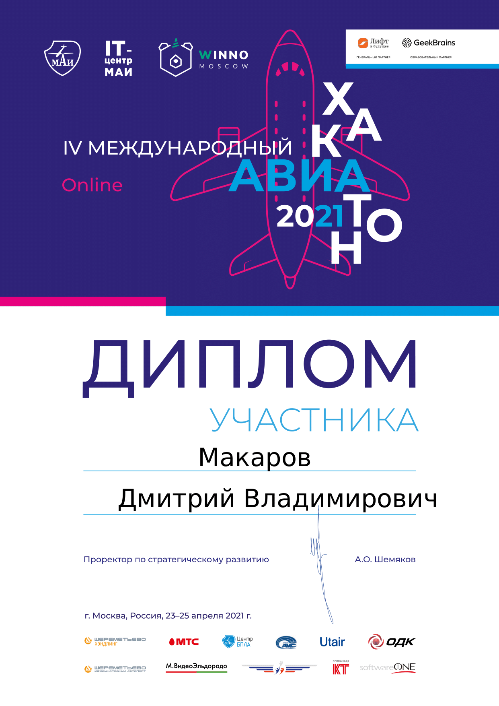

  <a href="" rel="noopener">

<h1 align="center">Hi 👋, I'm Dmitriy Makarov</h1>
<h3 align="center">flutter and unity proffesional developer from Russia</h3>

📫 How to reach me:

- telegram : **@mentoster**

- vk : **[@dimamakarov12345](https://vk.com/dimamakarov12345)**

---

---

I have participated in the following hackathons...

  
  
  

  
  
  

  

Stats...

  

