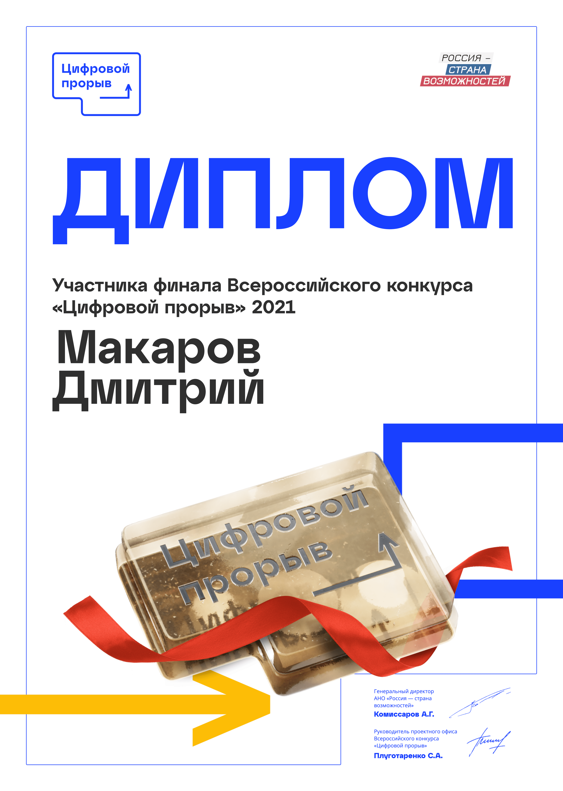
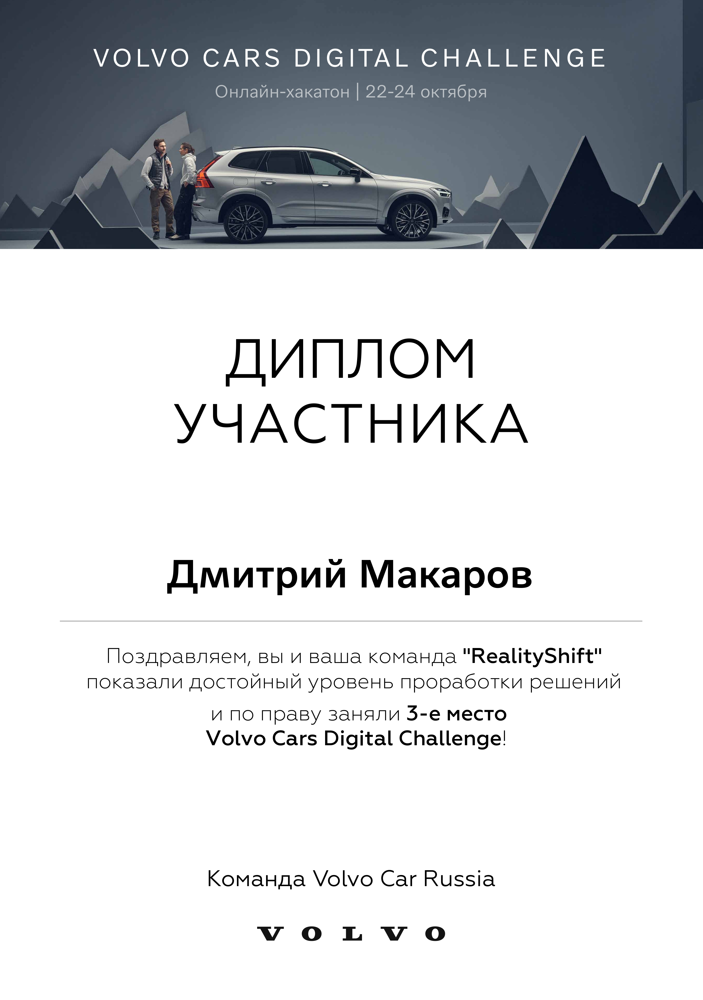

  <a href="" rel="noopener">

<h1 align="center">Hi 👋, I'm Dmitriy Makarov</h1>
<h3 align="center">flutter, unity professional developer and designer from Russia</h3>

📫 How to reach me:
* [telegram](https://telegram.org/) : **[@mentoster](https://t.me/Mentoster)**
* [vk](https://vk.com/) : **[@dimamakarov12345](https://vk.com/dimamakarov12345)**

---

Last week used languages

## Certificates

---
Certificate  | Description
--- | ---
 | Junction Asia (gamedev)
 | Junction Winner Team (Game dev)
 | Aviahackaton by [MAI](https://en.wikipedia.org/wiki/Moscow_Aviation_Institute) (mobile dev)
 | [Leaders of Digital](https://leadersofdigital.ru/) - the biggest Russian Hackaton, Winner team (mobile and game dev)
 | [Leaders of Digital](https://leadersofdigital.ru/) - the biggest Russian Hackaton (mobile dev)
 | Winner team - [Tele2](https://ru.wikipedia.org/wiki/Tele2) Hack (gamedev +- mobile)
| [Leaders of Digital](https://leadersofdigital.ru/) - the biggest Russian Hackaton (game dev)
| URBAN technology by [SUM](https://en.wikipedia.org/wiki/State_University_of_Management) (mobile dev)
| [Volvo](https://ru.wikipedia.org/wiki/Volvo) Cars Digital Challenge (mobile dev)
| Moscow hackathon (web dev)
