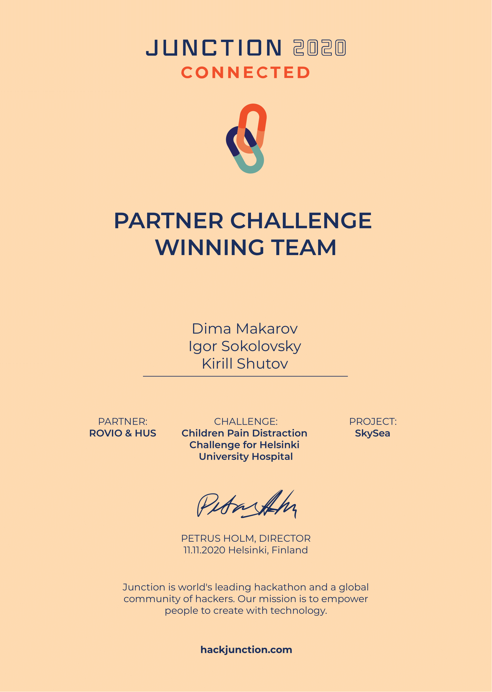
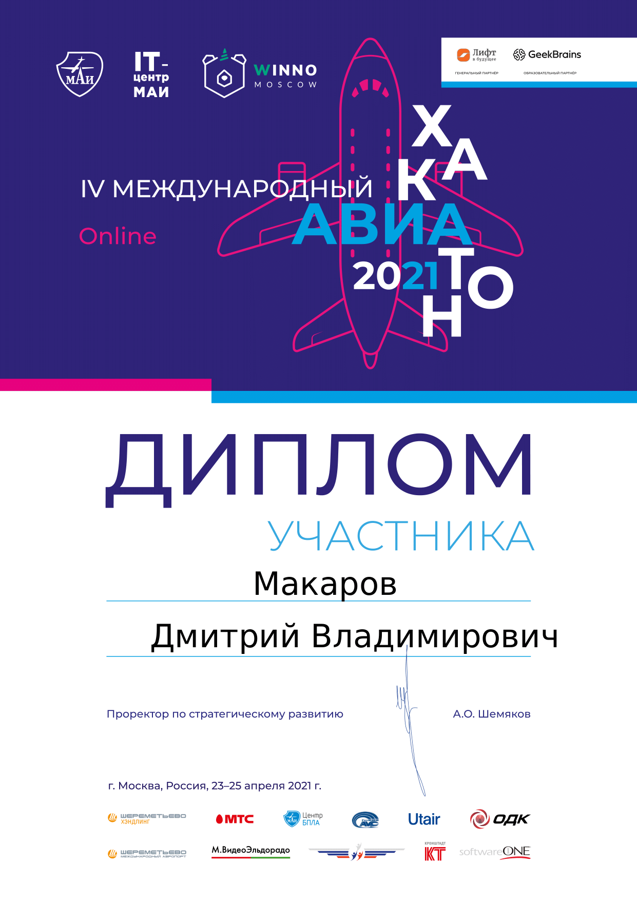
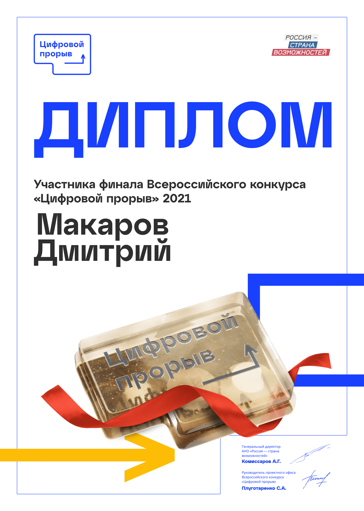
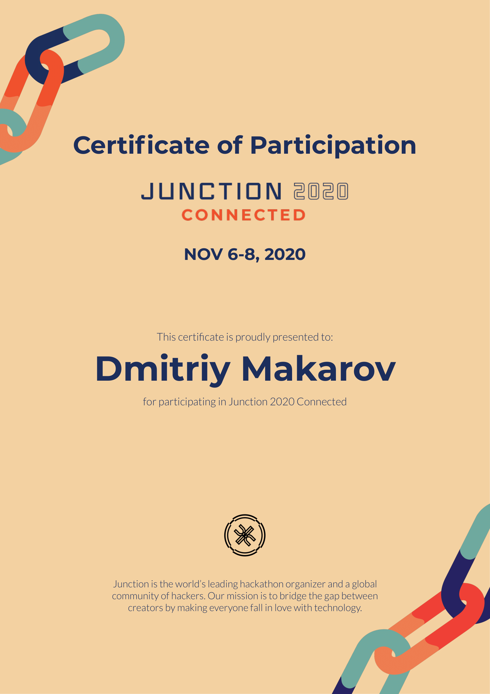

  <a href="" rel="noopener">

<h1 align="center">Hi 👋, I'm Dmitriy Makarov</h1>
<h3 align="center">Flutter professional developer </h3>

📫 How to reach me:
* [telegram](https://telegram.org/) : **[@mentoster](https://t.me/Mentoster)**
* [vk](https://vk.com/) : **[@dimamakarov12345](https://vk.com/dimamakarov12345)**

---

## Certificates

  

I won  in the following hackathons...

  
  

  

  

  
  
  

  

I have participated in the following hackathons...

  
  
  

  
  
  

  
  
  

